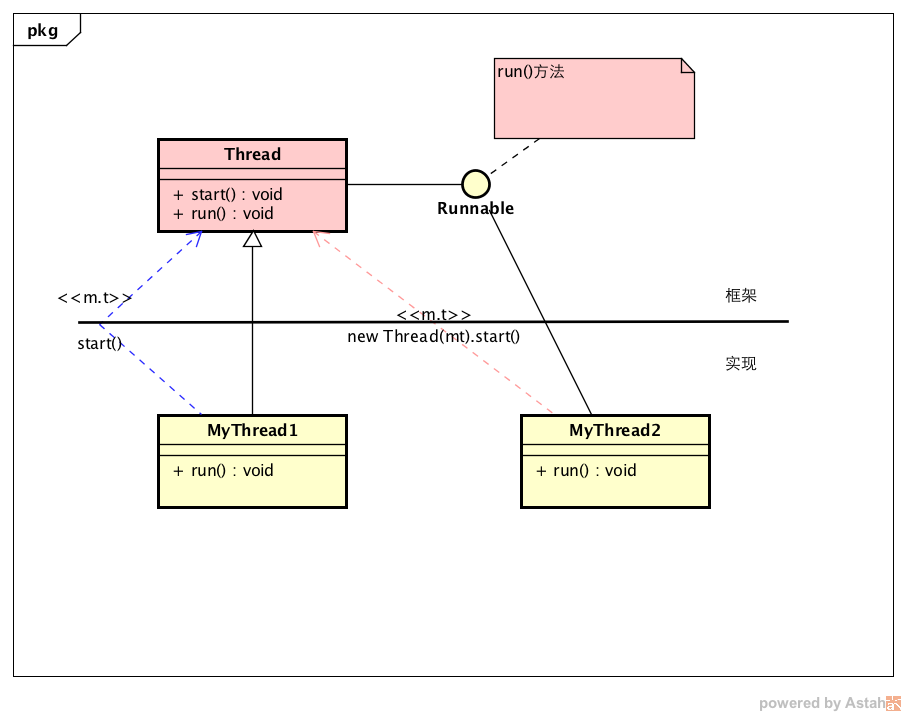

## Thread简单理解
   JAVA中的Thread与Runnable可以很好的体现EIT造型。(EIT是台湾架构师高老师创造出来的，个人感觉非常的好。)
由于刚学习怎么画UML，简单的画了个图形：

从图中要以看出，在JAVA中要创建一个线程，要么继承Thread类，要么实现Runnable接口。不管使用哪种方式，都需要重写或者实现run()方法。可能很多人都碰到过有人讨论哪种方式比较好，其实你看过源代码后，结合EIT，你会发现两种方式都是一样的，不存在哪个好哪个不好。当然其中还是有点差别的。
   所谓EIT(Engine Interface Tire)，就是开发框架的把E和I写好，然后我们码农按照自己的需求把T给写了。
   不管你使用哪种方式，都是实现了接口中的run()方法，因为Thread本身就实现了Runnable接口。

```bash
	public
	interface Runnable {
	    public abstract void run();
	}
```
```bash 
	public
	class Thread implements Runnable {
	    public Thread() {
	        init(null, null, "Thread-" + nextThreadNum(), 0);
	    }
	
	    public Thread(Runnable target) {
	        init(null, target, "Thread-" + nextThreadNum(), 0);
	    }
	    public synchronized void start() {
	        if (threadStatus != 0)
	            throw new IllegalThreadStateException();
	        group.add(this);
	
	        boolean started = false;
	        try {
	            start0();
	            started = true;
	        } finally {
	            try {
	                if (!started) {
	                    group.threadStartFailed(this);
	                }
	            } catch (Throwable ignore) {
	                /* do nothing. If start0 threw a Throwable then
	                  it will be passed up the call stack */
	            }
	        }
	    }
	
	    private native void start0();
	}
```

从源代码中我们可以知道，不管使用哪种方式都是调用的init()方法，只是参数不同。但是实现Runnable接口的写法通过new Thread(mt).start()可以实现资源共享(这里不做讨论，有兴趣的朋友可以找找资料)。
当我们调用start()方法时便启动了线程，start()方法中又调用了一个本地方法start0()，而这个本地方法是通过JNI去调用的C的方法，然后C中调用了我们实现的run()方法，这种方式就叫做IOC，通过基类调用子类的方式就是一种简单的IOC实现。
结合上面的UML以及EIT造形，其实Thread就是一个框架，我们来实现而已，你会发现不管什么代码中，会经常出现EIT，简单的复杂的都是基于EIT来组成的。
这里我没有说很多关于Thread以及Thread相关类的用法，因为我觉得这是别人写的东西，目标是了解其工作原理，至于怎么用，就算是你自己写的东西，时间长了你也会忘记的。